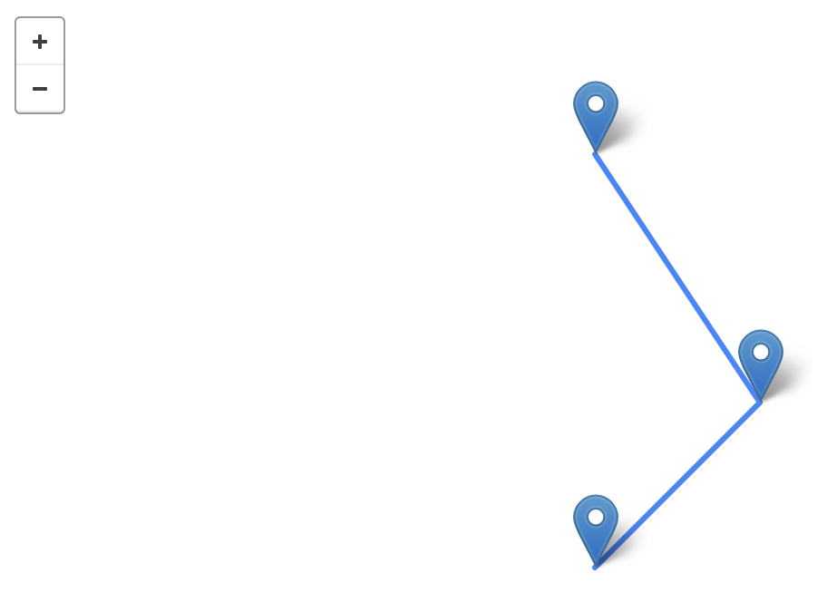

[](https://classroom.github.com/a/8auyaefV)
# Project-6-GeoJSON (Recursion)

Test driven development task to demonstrate the recursion using OOP.

A project to build a GeopJSON representation. The project is 
inspired by the GeoJSON package found in PyPi, but it diverges a 
lot from the implementation found their.

> GeoJSON is a geospatial data interchange format based on JavaScript
> Object Notation (JSON). It defines several types of JSON objects and
> the manner in which they are combined to represent data about
> geographic features, their properties, and their spatial extents.
> GeoJSON uses a geographic coordinate reference system, World Geodetic
> System 1984, and units of decimal degrees.

The specification is defined at https://datatracker.ietf.org/doc/html/rfc7946

The JSON format is heavily used to define features of maps on the web.
A json script like the one found below can render something as seen in
the image below.

```json
{
  "geometries": [
    {"coordinates": [1, 1], "type": "Point"},
    {"coordinates": [3, 3], "type": "Point"},
    {"coordinates": [1, 6], "type": "Point"},
    {"coordinates": [[1, 1], [3, 3]], "type": "LineString"},
    {"coordinates": [[[1, 1], [3, 3], [1, 6]]], "type": "MultiLineString"}
  ],
  "type": "GeometryCollection"
}
```


You can regenerate the same rendering easily by using the following
web-based tool (https://geojsonlint.com/). 

## Assignment:

- Similar to the last assignment the workflow is as usual:
    1. Before you edit any file, carefully read the comments inside each file.
    2. Test your program locally; revise and re-test as needed. 
    3. Commit and push your changes to your own repository.
    4. The `credentials.ini` file is not provided, but you have to create one yourself and submit it to
       [Blackboard](https://lms.qu.edu.sa/) as we have seen in project-0.
- This project has many files. We recommend you explor them on 
  the following order:
  - `geo.py`
  - `point.py`
  - `line.py`
  - `polygon.py`
  - `g_colloection.py`
- The `geo.py` is where we keep the main abstract class. It defines all
  the base methods. No all of them are going to be implemented on subclasses,
  but it is important to understand what we have.
- The `point.py` module defines two classes `Point` and `MultiPoint`. The point
  assume we have only one points with an x and y coordinates. On the other hand,
  the MultiPoint accepts as many points as the user wants. 
- The `line.py` module defines two more classes `LineString` and `MultiLineString`.
  Similar to the previous module, LineString defines a single line while
  MultiLineString defines multiple lines. Each should have its GeoJSON representation.
- The `polygon.py` module defines yet two more classes `Polygon` and `MultiPolygon`.
  These can take points and line to define a polygon. Following the same pattern 
  the Polygon class defines a single polygon where the MultiPolygon defines multiple
  polygons.
- The last module `g_collection.py` defines a single class names `GeometryCollection`.
  It can hold any object of the ones we have seen so far to describe a collection.
- For each class of the ones we have seen so far, we use the docstring to define how 
  it can be used and what would be expected of its `__str__` representation. We use 
  the `__str__` method to generate the out in GeoJSON format for each object.
- You are asked to implement (among other things) the `__str__` method for each one 
  of these classes. It is left to you to decide which one of the `__str__` method should
  be a base case and which one should be a recursive case.
- There are other method that you are also asked to implement. For example, 
  you will implement some of the `get_coordinate` method of the classes we have.
  All what you have to implement is marked with a `TODO` comment that gives more description
  of what you should do.
- Each module has its own `test*.py` module that can give you a hint of what you should
  implement of the base method and what you should leaf as a `NotImpelemnted`.
- The test cases try to give you a hint of how the output should be. However, 
  it is important that you think of more cases. For example, in the case of classes that
  take more one element (within a list), you should think of how the output would look like
  if more objects are given within the initialization step.
- The `type(self) -> str` method is given to your for a purpose. You can make use of it to
  generate the GeoJSON type automatically.
- When you have completed these steps, all the test cases should succeed. Note that this is not an
  ironclad guarantee that your code is correct. We will use a few more tests, which we do not share
  with you, in grading. Our extra tests help ensure that you are really solving the problem and not
  taking shortcuts that provide correct results only for the known tests.

## Reminders

- The `credentials.ini` file MUST include your full information. And must be named correctly.

- DO NOT push any changes to your repo after the deadline. When we clone
  your repo given the key, we will check when was the last update on your
  repository. If you made any changes passed the deadline you will immediately 
  get 20% deducted.

## Grading Rubric

- **[100 Points]** For passing all OUR tests. As stated in the assignment instructions, we
  will have our own additional test cases that test the same core functionalities but make
  sure you're not taking any shortcuts. Passing all of them guarantees you will get full points.
- **[40 points]** Bonus points will be allocated to providing a solution that adheres to our
  coding style. This project can be challenging to make it 100% compatible with our coding style.
  Thus, the more you make it compatible the more points you will get. Below is our usual command
  to check the coding style compatibility.


In addition to passing all test cases, you should also adhere to our coding style principles. You should always refer
to the coding style cheat sheet. However, one of the most essential representations we agreed on is to give the hints types.
For example, when we say a `self` method `foo` should take two integers `x` and `y`, and return a string. The expected method signature should look like this `def foo(self, x: int, y: int) -> str:`.
As always, when in doubt, check the [PEP8](https://peps.python.org/pep-0008/) instructions.
To double-check your work use the following two commands.
- `pylint --attr-naming-style any --argument-naming-style any <file_name.py>`
- `flake8 --select="ANN001,ANN201,ANN202,ANN203,ANN204,ANN205,ANN206" --suppress-none-returning <file_name.py>`

# All Rights Reserved

This is the work of Ziyad Alsaeed. Any copy or distribution of this
repository or a fork of it in a way other than the instruction provided
above will subject you to legal proceedings.