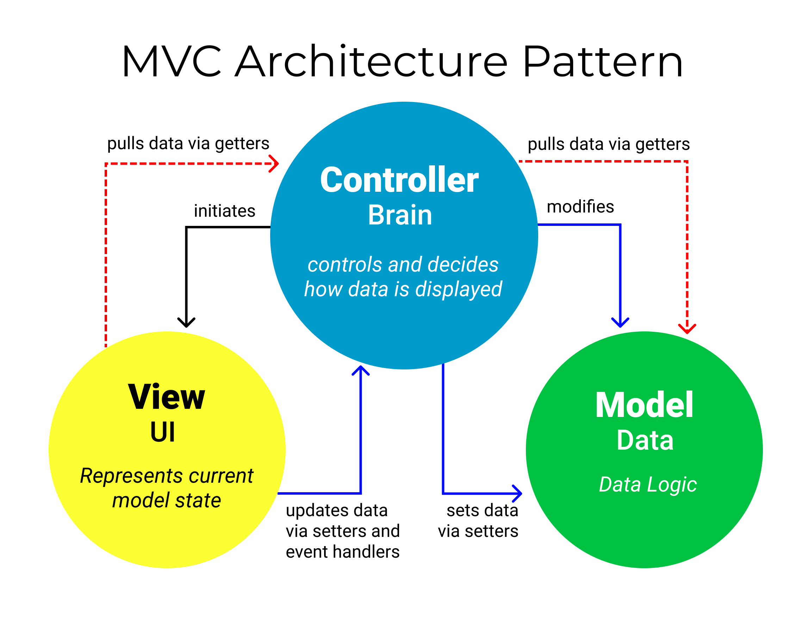
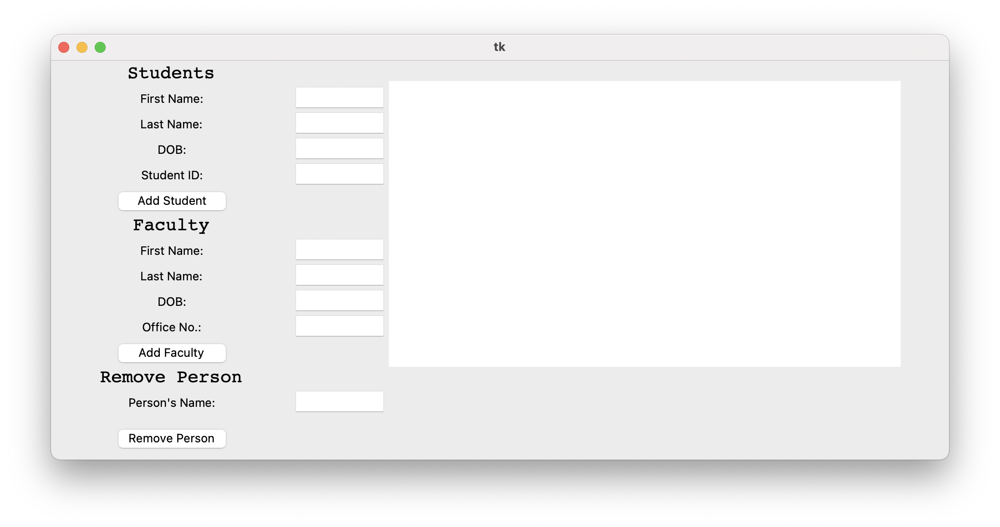

# Project-5-People (MVC using GUI)

Test driven development task to demonstrate the MVC pattern with a GUI interface.

Similar to the previous project, the goal of this project is to create a model that adds People to a database
(list). The interaction between the View, Controller and Model
is designed following the MVC pattern. This time, however, we are using a
GUI interface instead of CLI.

## Prerequisite

You have to install tkinter. There are many ways on how you may do so.

- For Windows `pip install tk` or `pip install python-tk`. Also, you may have to use `pip3` instead of `pip`.
- For macOS, you may do so using `brew install python-tk` or `pip3 install python-tk`.
- For Linux, you may install it using `pip install tk`, `pip install python-tk` or `sudo apt-get install python3-tk`.

## Assignment:

- Similar to the last assignment the workflow is as usual:
    1. Before you edit any file, carefully read the comments inside each file.
    2. Test your program locally; revise and re-test as needed. 
    3. Commit and push your changes to your own repository.
    4. The `credentials.ini` file is not provided, but you have to create one yourself and submit it to
       [Blackboard](https://lms.qu.edu.sa/) as we have seen in project-0.
- The goal of this project is to practice how the MVC help change the interface without
  changing the model. Therefore, assuming you correctly implemented the `person.py` and
  `persons.py`, then you should not change them at all. Please note that the two files
  are not provided here. You have to add them yourself. 
- Unlike the last project, you will implement most of the view (`gui.py`) and the
  controller (`controller.py`).
- Also unlike the previous projects, this time you will have to go back and forth
  between the two files `controller.py` and `gui.py`. Although, you could mostly implement 
  the view (`gui.py`) without the need to look into the controller. 
- The controller is the main driver of this application. Hence, it initializes both
  the model and the view classes. Most importantly it is responsible for binding
  the buttons from the view (`gui.py`) to its own methods. 
- The initializer in `controller.py` links the keys 1, 2, and 3 to the add-student,
  add-faculty, and remove-person methods from `self` using a dictionary. At the same time
  the `gui.py` class links the same keys 1, 2, and 3 to the buttons add-student, add-faculty,
  and remove-person.
- The binding setup between `controller.py` and `gui.py` ensures that we don't have circular
  imports and at the same time the view (`gui.py`) have access to the `controller.py` methods.
- All the binding functions and statements are given for you. However, you have to carefully
  understand how they work in order to implement the other functionalities.
- Both the `controller.py` and `gui.py` have the three methods `add_student`, `add_faculty`,
  and `remove_person`. These three methods on each class need each other. This is why you need
  to go back and forth between them.
- One additional part you have to add to the `gui.py` is the faculty element of the interface. 
  It is the same as we did with the student. The only difference is in the placement of elements
  within the columns and rows of the window. We are asking you to do this part to get a feeling
  of how to work with the GUI.
- The `utility.py` file is the same from the previous project. If you implemented it correctly in the
  previous project then you only need to copy it here. 
- When you have completed these steps, all the test cases should succeed. Note that this is not an
  ironclad guarantee that your code is correct. We will use a few more tests, which we do not share
  with you, in grading. Our extra tests help ensure that you are really solving the problem and not
  taking shortcuts that provide correct results only for the known tests.
- In addition to passing all test cases, you should also adhere to our coding style principles. You should always refer
  to the coding style cheat sheet. However, one of the most essential representations we agreed on is to give the hints types.
  For example, when we say a `self` method `foo` should take two integers `x` and `y`, and return a string. The expected method signature should look like this `def foo(self, x: int, y: int) -> str:`.
  As always, when in doubt, check the [PEP8](https://peps.python.org/pep-0008/) instructions.
  To double-check your work use the following two commands.
    - `pylint --attr-naming-style any --argument-naming-style any <file_name.py>`
    - `flake8 --select="ANN001,ANN201,ANN202,ANN203,ANN204,ANN205,ANN206" --suppress-none-returning <file_name.py>`

## GUI

The view in this project is designed as a grid. Although you cannot see it,
the screen is divided into rows and columns. Each element in our view is placed
in a specific cell. In the table below we show the cells indexing using rows
and columns (row_idx, column_idx).

| (0, 0)  | (0, 1)  | (0, 2)  |
|---------|---------|---------|
| (1, 0)  | (1, 1)  | (1, 2)  |
| (2, 0)  | (2, 1)  | (2, 2)  |
| (3, 0)  | (3, 1)  | (3, 2)  |
| (4, 0)  | (4, 1)  | (4, 2)  |
| (5, 0)  | (5, 1)  | (5, 2)  |
| (6, 0)  | (6, 1)  | (6, 2)  |
| (7, 0)  | (7, 1)  | (7, 2)  |
| (8, 0)  | (8, 1)  | (8, 2)  |
| (9, 0)  | (9, 1)  | (9, 2)  |
| (10, 0) | (10, 1) | (10, 2) |
| (11, 0) | (11, 1) | (11, 2) |
| (12, 0) | (12, 1) | (12, 2) |
| (13, 0) | (13, 1) | (13, 2) |

The expected GUI when you run a correctly implemented application! 

## Reminders

- The `credentials.ini` file MUST include your full information. And must be named correctly.

- DO NOT push any changes to your repo after the deadline. When we clone
  your repo given the key, we will check when was the last update on your
  repository. If you made any changes passed the deadline you will immediately 
  get 20% deducted.

## Grading Rubric

- **[80 Points]** For passing all OUR tests except the two performance tests. As stated in the assignment instructions, we will have our own additional
  test cases that test the same core functionalities but make sure you're not taking any shortcuts. Passing all of
  them guarantees you will get full points.
- **[20 Points]** For following the given coding style as given in the cheat sheet and PEP8.
- **[10 points]** Bonus points for beautifying the screen and demoing your work. 

# All Rights Reserved

This is the work of Ziyad Alsaeed. Any copy or distribution of this
repository or a fork of it in a way other than the instruction provided
above will subject you to legal proceedings.