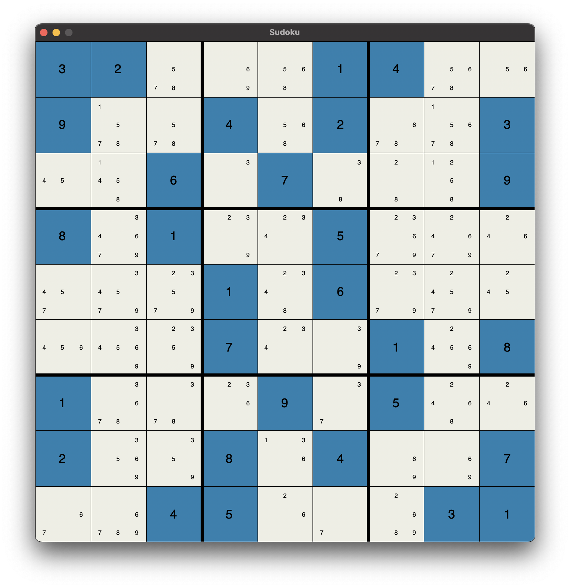
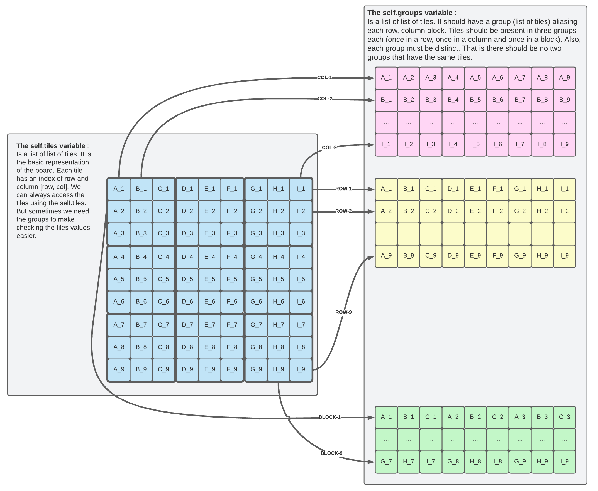

# Project-7-Sudoku-Checker

Test driven development task to demonstrate the benefits of aliasing
and usage of notifiers in an MVC pattern.

This is a project based on the [sudoku game](https://en.wikipedia.org/wiki/Sudoku). In this project,
we just try to check if the board is consistent. I.e, that it follows
the game rules by not having duplicate numbers in the same row,
columns or block.

## Prerequisite

You have to install tkinter. There are many ways on how you may do so.

- For Windows `pip install tk` or `pip install python-tk`. Also,
  you may have to use `pip3` instead of `pip`.
- For macOS, you may do so using `brew install python-tk` or
  `pip3 install python-tk`.
- For Linux, you may install it using `pip install tk`,
  `pip install python-tk` or `sudo apt-get install python3-tk`.

## Assignment:

- Similar to the last assignment the workflow is as usual:
    1. Before you edit any file, carefully read the comments inside each file.
    2. Test your program locally; revise and re-test as needed. 
    3. Commit and push your changes to your own repository.
    4. The `credentials.ini` file is not provided, but you have to create one yourself and submit it to
       [Blackboard](https://lms.qu.edu.sa/) as we have seen in project-0.
- The goal of this project is to practice making use of aliases.
  The only file you should be editing is the `board.py` file. However,
  it is essential to understand how all the files are integrated and work. 
- The first task you should complete is to complete the groups build
  found in the `board.Board.__init__`. Part of the code is given for you.
  That is we add all the rows and blocks to the groups list aliasing
  the actual tiles in the board. All you need is to add the columns
  following the same logic.

- The second task you should work on is to print the board following the
  Sadman format. This is the method `board.Board.__str__()`. The format
  is given for you in the [sample file](data/00-sample.sdk).
- The third and last task you have to do is to check for consistency in
  the board you are given. This is the method named
  `board.Board.is_consistent(self)`. This is exactly what you would do
  to check if game is solved except in checking if it is solved you need
  to make sure no tiles are empty (UNKNOWN). To make this easier for you,
  we have given you a pseudocode that should walk you step-by-step toward
  the solution.
- When you have completed these steps, all the test cases should succeed.
  Note that this is not an ironclad guarantee that your code is correct.
  We will use a few more tests, which we do not share with you, in
  grading. Our extra tests help ensure that you are really solving the
  problem and not taking shortcuts that provide correct results only for
  the known tests.
- In addition to passing all test cases, you should also adhere to our
  coding style principles. You should always refer to the coding style
  cheat sheet. However, one of the most essential representations we
  agreed on is to give the hints types. For example, when we say a
  `self` method `foo` should take two integers `x` and `y`, and return
  a string. The expected method signature should look like this
  `def foo(self, x: int, y: int) -> str:`. As always, when in doubt,
  check the [PEP8](https://peps.python.org/pep-0008/) instructions.
  
  To double-check your work use the following two commands.
    - `pylint --attr-naming-style any --argument-naming-style any <file_name.py>`
    - `flake8 --select="ANN001,ANN201,ANN202,ANN203,ANN204,ANN205,ANN206" --suppress-none-returning <file_name.py>`

## Reminders

- The `credentials.ini` file MUST include your full information.
  And must be named correctly.

- DO NOT push any changes to your repo after the deadline. When
  we clone your repo given the key, we will check when was the last
  update on your repository. If you made any changes passed the
  deadline you will immediately get 20% deducted.

## Grading Rubric

- **[80 Points]** For passing all OUR tests. As stated in the
  assignment instructions, we will have our own additional test cases
  that test the same core functionalities but make sure you're not
  taking any shortcuts. Passing all of them guarantees you will get
  full points.
- **[20 Points]** For following the given coding style as given in the cheat sheet and PEP8.
- **[10 points]** Bonus for anyone who finds and fixes a bug! 

# All Rights Reserved

This is the work of Ziyad Alsaeed. Any copy or distribution of this
repository or a fork of it in a way other than the instruction provided
above will subject you to legal proceedings.