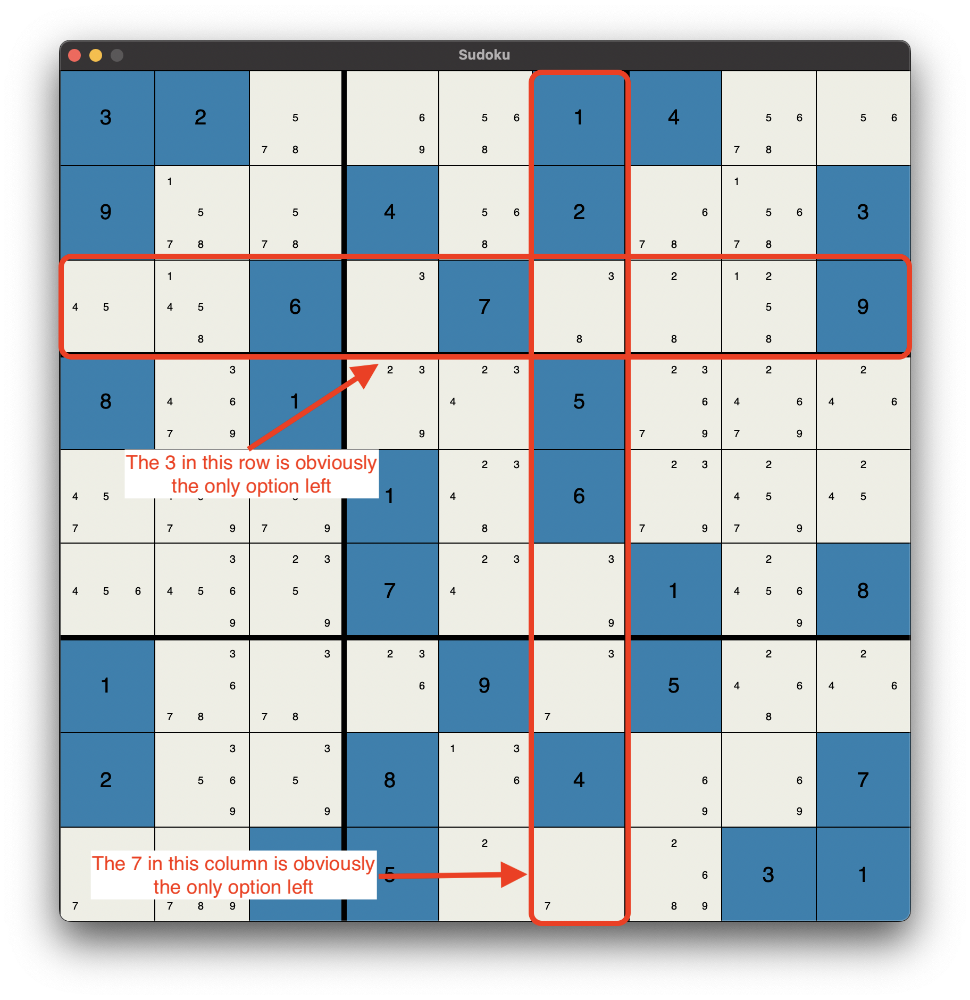
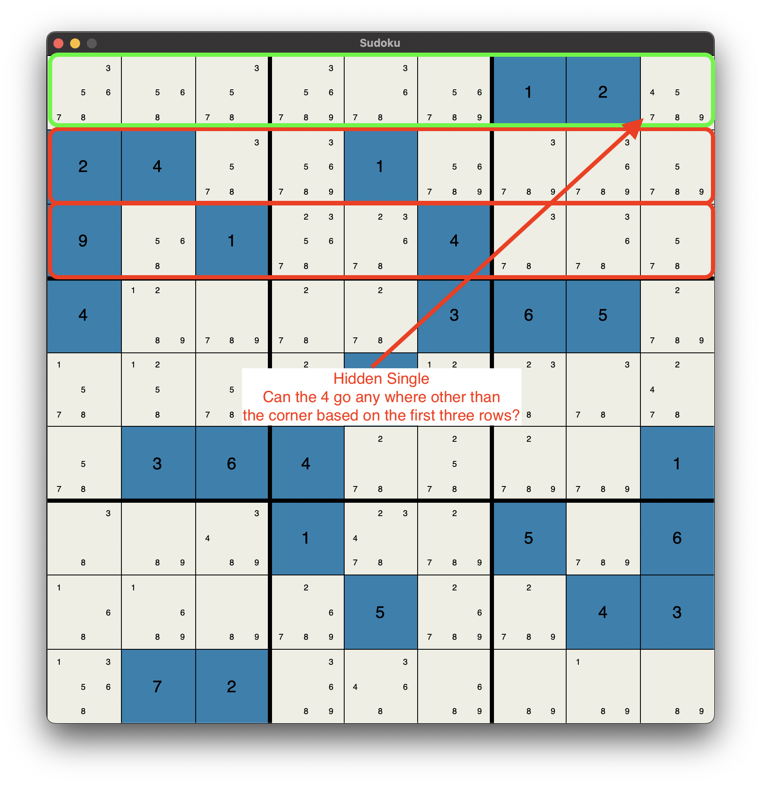

# Project-8-Sudoku-Solver

Test driven development task to demonstrate all what you learned in this course on a single project.

This is a project based on the [sudoku game](https://en.wikipedia.org/wiki/Sudoku). In this project, we build on top
of what we implemented on project-6. Since we now can check for board consistency, it is time to try to solve it.
We will eventually use the guess-and-check technique. However, guess-and-check alone will not be a good approach to
solving sudoku. Hence, we apply simple pencil tactics that we use as humans to eliminate as many candidates as
we can. We name these as the `obvious single` and the `hidden single`. The tactics are described as follows:

## Obvious Single

If you solve Sudoku by hand, you may use "pencil marks" to indicate the values that can appear in a tile. If a 3 appears
anywhere in the row, you mark off the 3 in the "pencil marks". If a 3 appears anywhere in the column or block, you
likewise mark off the "3" in the pencil marks for tile. If there is only one pencil mark that is not crossed off,
then we can determine that the tile must hold that value.

## Hidden Single

Suppose that after applying the obvious single tactic to eliminate some candidates, all the unknown tiles still
have at least two candidate values. But suppose only one of those tiles has candidate value 4. Even though the tile
that has candidate value 4 may have other candidate values, we know it must hold the 4 because there is no other
place to put it. This is the hidden single solving technique.

## Guess and Check

Although the obvious single and hidden single tactics can solve some puzzles, they for sure cannot solve every puzzle.
Sometimes we have to guess and check (if you don't believe me run `python3 sudoku.py -d -i data/00-sample.sdk` once you
implement obvious and hidden single). But having obvious and hidden single is very useful, because guessing in the
wild will take a very long time. We can combine all obvious single, hidden single and guess-and-check to find a solution
for the most difficult puzzles in a very short time. And this is what we will exactly do in this project.   

## Dependencies

You have to install tkinter. There are many ways on how you may do so.

- For Windows `pip install tk` or `pip install python-tk`. Also, you may have to use `pip3` instead of `pip`.
- For macOS, you may do so using `brew install python-tk` or `pip3 install python-tk`.
- For Linux, you may install it using `pip install tk`, `pip install python-tk` or `sudo apt-get install python3-tk`.

## Assignment:

- Similar to the last assignment the workflow is as usual:
    1. Before you edit any file, carefully read the comments inside each file.
    2. Test your program locally; revise and re-test as needed. 
    3. Commit and push your changes to your own repository.
    4. The `credentials.ini` file is not provided, but you have to create one yourself and submit it to
       [Blackboard](https://lms.qu.edu.sa/) as we have seen in project-0.
- This is a build upon your last project; thus, for each method you implemented in the past you have to copy it here.
  Please note that the `__str__` is given for you here. 
- The first method you need to pay attention to is the `Tile.remove_candidates` method. This is the method that we
  will use in obvious single and hidden single to eliminate candidates. The method takes a set of values and remove
  them from the tile candidates if they are there. It returns True if we changed anything (removed some candidate) and
  False if nothing happened. Also, if the tile has only one candidate left, then it should use that candidate to set
  the tile value using the `set_value` method that is already implemented.
- Now you can move to `obvious_single` to implement it. The description of what the method does and how it should be
  implemented is given above and within the code itself.
- Once you are done with `obvious_single` you should implement the `hidden_single`. Similar to the previous tactic,
  its description is given above and in the code itself.
- Now the only major function left for you is the `solve_using_guess_and_check`, but the function needs some helper
  functions. We implemented one for you (`as_list()`), you have to implement the `min_choice_tile` and `is_complete`.
  Both functions have a description given in the code to help you implement them. But in a nutshell, the `is_complete`
  checks if all the tile have values other than UNKNOWN regardless of its correctness. While the `min_choice_tile`
  return the tile with the least number of candidates. We need the tile to make sure we start guessing with the tile
  that has the least number of values to guess from. 
- Now all you have left is to guess-and-check. The pseudocode for the function is given in the code.
- Usage:
  - `python3 sudoku.py -o data/01-obvioussingle.sdk` To solve the `01-obvioussingle.sdk` puzzle using obvious
    single only.
  - `python3 sudoku.py -i data/02-hiddensingle.sdk` To solve the `02-hiddensingle.sdk` puzzle using obvious
    single and hidden single.
  - `python3 sudoku.py -d data/00-sample.sdk` To solve the `00-sample.sdk` puzzle using obvious single,
    hidden single, and guess-and-check.
- When you have completed these steps, all the test cases should succeed. Note that this is not an
  ironclad guarantee that your code is correct. We will use a few more tests, which we do not share
  with you, in grading. Our extra tests help ensure that you are really solving the problem and not
  taking shortcuts that provide correct results only for the known tests.
- In addition to passing all test cases, you should also adhere to our coding style principles. You should always refer
  to the coding style cheat sheet. However, one of the most essential representations we agreed on is to give the hints types.
  For example, when we say a `self` method `foo` should take two integers `x` and `y`, and return a string. The expected method signature should look like this `def foo(self, x: int, y: int) -> str:`.
  As always, when in doubt, check the [PEP8](https://peps.python.org/pep-0008/) instructions.
  To double-check your work use the following two commands.
    - `pylint --attr-naming-style any --argument-naming-style any <file_name.py>`
    - `flake8 --select="ANN001,ANN201,ANN202,ANN203,ANN204,ANN205,ANN206" --suppress-none-returning <file_name.py>`

## Reminders

- The `credentials.ini` file MUST include your full information. And must be named correctly.

- DO NOT push any changes to your repo after the deadline. When we clone
  your repo given the key, we will check when was the last update on your
  repository. If you made any changes passed the deadline you will immediately 
  get 20% deducted.

## Grading Rubric

- **[80 Points]** For passing all OUR tests related to obvious and hidden guess. As stated in the assignment instructions, we will have our own additional
  test cases that test the same core functionalities but make sure you're not taking any shortcuts. Passing all of
  them guarantees you will get full points.
- **[20 Points]** For following the given coding style as given in the cheat sheet and PEP8.
- **[50 points]** Bonus for implementing the guess-and-check method with all of its helper functions! Also, for making the guess-and-check function finish within the reasonable time we specified in the test cases. 

# All Rights Reserved

This is the work of Ziyad Alsaeed. Any copy or distribution of this
repository or a fork of it in a way other than the instruction provided
above will subject you to legal proceedings.